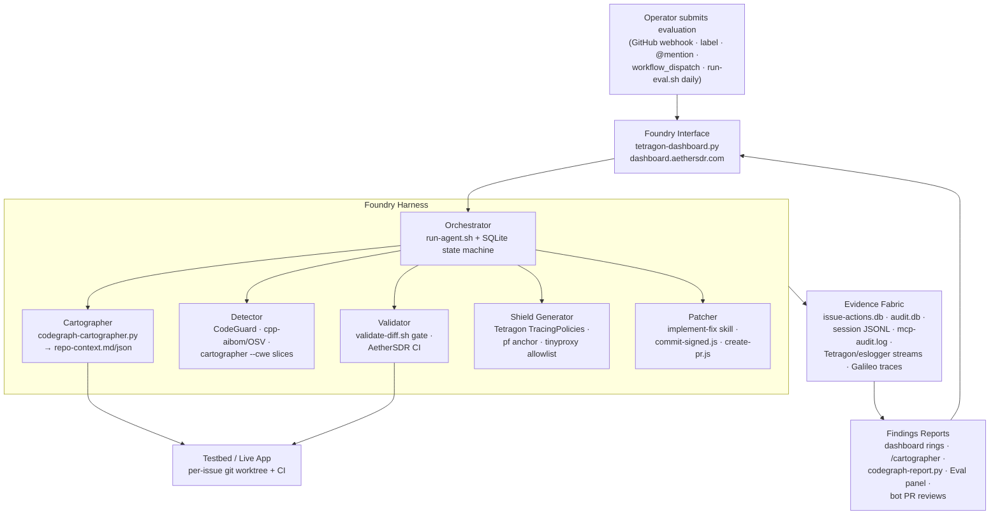

# AetherClaude ↔ Cyber AI Foundry Evaluation Pipeline

How the Cisco Cyber AI Foundry **Evaluation Pipeline** (Operator → Foundry
Harness → Testbed / Evidence Fabric → Findings Reports) maps onto the
AetherClaude deployment, stage by stage, and which of our deployed Cisco AI
tools implements each stage. Companion to
[AetherClaude-Cisco-Scanner-Integration-Plan.md](AetherClaude-Cisco-Scanner-Integration-Plan.md)
and [AetherClaude-Security-Architecture.md](AetherClaude-Security-Architecture.md).

The Foundry principles are already load-bearing in the orchestrator —
`run-agent.sh` cites *Principle I (Evidence Over Assertion)* for the citation
gate and *Principle III* for the heartbeat watchdog. This doc completes the
picture at the pipeline level.

## Stage-by-stage mapping

| Foundry stage | Artifact in diagram | AetherClaude implementation | Cisco / third-party tool | Status |
|---|---|---|---|---|
| Operator submits evaluation | — | GitHub webhooks (issue labeled `aetherclaude-eligible`, PR opened, @mention), `workflow_dispatch`, `run-eval.sh` daily 05:00 | — | ✅ live |
| Cyber AI Foundry Interface | — | `tetragon-dashboard.py` (webhook receiver + operator UI at dashboard.aethersdr.com, HMAC-verified) | — | ✅ live |
| Orchestrator | — | `bin/run-agent.sh` + SQLite state machine (`issue-actions.db`); per-skill `/goal` completion contracts | — | ✅ live |
| **Cartographer** — map repo | Repo context | `bin/codegraph-cartographer.py`: L0 repo card / L1 subsystem map (Louvain) / L2 security overlay (`call_tags` dangerous-API sites, input boundaries, dep CVEs) / L3 key symbols by betweenness. Emits `repo-context.md` + `.json`, refreshes on the codegraph cadence, rendered at dashboard `/cartographer`. Consumed by implement-fix as of `ec0e425`. | codegraph suite + cpp-aibom CVE feed | ✅ live |
| **Detector** — scan source code | Candidate vulnerabilities | CodeGuard static analysis (changed files, blocks HIGH/CRITICAL); `cpp-aibom` dependency CVEs via OSV.dev; cartographer `--cwe CWE-NNN` prints focused repo slices for a detector harness | Cisco DefenseClaw CodeGuard · cpp-aibom | 🟡 partial — CodeGuard scans *our diffs*; a repo-wide Detector pass consuming the `--cwe` slices (Antares-1B per the cartographer design) is not yet wired |
| **Validator** — validate exploits/shields, preserve valid use | Confirmed vulns & shields | `validate-diff.sh` 8-check gate (protected paths, credential patterns, suspicious constructs, CodeGuard, Skill Scanner); AetherSDR CI on the PR is the behavioral check. "Preserve valid use" = the gate's allowlist of legitimate paths + CI regression suite | Cisco DefenseClaw CodeGuard · Cisco Skill Scanner | 🟡 partial — static + CI validation exists; no exploit *reproduction* in an isolated testbed |
| **Shield Generator** — create Isovalent policy | Targeted shields | Tetragon (Isovalent eBPF) TracingPolicies, pf anchor `com.aetherclaude`, tinyproxy allowlist — all hand-authored today | Isovalent Tetragon | 🔴 gap — shields are static; nothing generates a *targeted* policy from a confirmed finding |
| **Patcher** — create patch | Recommended patch | `skills/implement-fix.md` flow: clean worktree → Claude Code → blast-radius hook → `commit-signed.js` (rebase-before-diff, signed commits) → `create-pr.js` (draft PR, auto-merge) | — | ✅ live |
| Testbed / Live App | — | Per-issue git worktree + AetherSDR CI; `docker/codegraph` container for isolated extraction runs | — | 🟡 partial — CI is the only behavioral testbed; no live-app sandbox |
| Evidence Fabric | — | `issue-actions.db` (state machine + `bot_cost_audit`), `audit.db`, session JSONL, `mcp-audit.log`, Tetragon/eslogger event streams, Galileo multi-span agent traces | Isovalent Tetragon · Galileo | ✅ live (federated, not unified — see gaps) |
| Findings Reports | — | Dashboard ring views + scanner rows, `/cartographer` page, `codegraph-report.py`, Eval panel (Galileo scores), bot PR reviews/comments with cost footers | — | ✅ live |

## Deployed Cisco AI tool inventory (alignment reference)

| Tool | Where it runs | Pipeline stage(s) served |
|---|---|---|
| DefenseClaw CodeGuard | `validate-diff.sh` gate; `scan-security.sh` suite; gateway via `run-defenseclaw-gateway.sh` (token rotated weekly by `run-defenseclaw-rotate.sh`) | Detector, Validator |
| MCP Scanner (YARA + PROMPT_DEFENSE) | `scan-prompts-pd.py` against MCP tool declarations and prompt files | Validator (agent-side supply chain) |
| Skill Scanner (core + ATR + PromptGuard packs, ~314 rules) | `skill-scanner-with-packs.sh` in the validation gate | Validator (agent-side supply chain) |
| Isovalent Tetragon (eBPF) | `tetragon-dashboard.py` + TracingPolicies; every tool invocation audited | Shield Generator (policies), Evidence Fabric |
| cpp-aibom | Daily launchd run; OSV.dev CVE lookups; feeds cartographer L2 | Cartographer, Detector |
| agent-sbom (CycloneDX 1.6) | Daily launchd run; served at `/agent-sbom.json` | Evidence Fabric |
| VirusTotal binary scan | `run-vt-scan.sh` daily over agent binaries | Validator (agent-side) |
| Galileo | `run-eval.sh` daily: scores triage / implement / review flows, publishes traces + Eval panel | Evidence Fabric, Findings Reports |

## Gaps → next steps

1. **Detector harness (biggest gap).** The cartographer already emits
   `--cwe`-focused repo slices designed for a Detector stage; nothing consumes
   them for a proactive repo-wide scan yet. Next: a `run-detector.sh` cadence
   job that walks the L2 overlay categories, feeds each slice to the detector
   model, and writes candidate findings into the evidence DB for Validator
   triage.
2. **Shield generation.** Tetragon policies are hand-authored. Next: a
   findings→TracingPolicy generator so a confirmed finding (e.g. a `cmd_exec`
   site) emits a targeted policy (block/alert on that binary+syscall pattern)
   instead of waiting for a human to write one.
3. **Exploit validation testbed.** `validate-diff.sh` is static and CI only
   proves the patch compiles/passes tests — neither *reproduces* a candidate
   vulnerability. Next: reuse the `docker/codegraph` container pattern for a
   throwaway testbed that attempts the exploit before and after the patch
   ("confirmed vulnerability" + "shield preserved valid use" in one run).
4. **Evidence Fabric unification.** Evidence is federated across three SQLite
   DBs, JSONL logs, and Galileo. The dashboard joins them visually, but there's
   no single queryable fabric keyed by evaluation/trace ID. Next: a
   `findings` table in `issue-actions.db` that every stage writes to, keyed by
   the existing `AETHER_TRACE_ID`.

Ordering rationale: 1 unlocks the pipeline's *proactive* mode (today the
Detector only fires reactively on diffs we author); 2 and 3 turn confirmed
findings into enforcement; 4 is the cross-cutting join that makes Findings
Reports one query instead of five.
